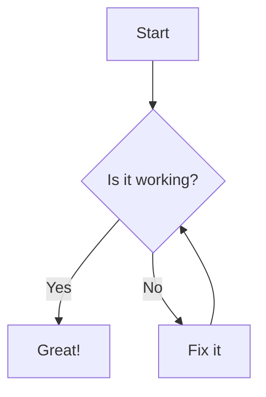

# MkDocs Documentation Generator

Generate and serve beautiful documentation using MkDocs with support for local folders and Git repositories.

## Configuration

### Source Type: Local Folder

Use this option when your documentation files are stored locally in Home Assistant.

```yaml
source_type: "local"
local_path: "" (leave this empty for default folder)
```

**Setup Steps:**

1. Create a folder in your Home Assistant configuration directory
2. Create a `docs/` subfolder for your markdown files
3. Add your content to the `docs/` folder
4. Optionally create a custom `mkdocs.yml` configuration file

**Example folder structure:**

```
/config/mkdocs/
├── mkdocs.yml (optional)
├── docs/
│   ├── index.md
│   ├── about.md
│   └── assets/
│       └── images/
```

### Source Type: Git Repository

Use this option to automatically pull documentation from a Git repository.

```yaml
source_type: "git"
git_url: "git@github.com:username/docs-repo.git"
ssh_key_path: "/ssl/mkdocs_ssh_key"
```

**Setup Steps:**

1. Generate an SSH key pair for repository access
2. Add the public key to your Git repository as a deploy key
3. Copy the private key to Home Assistant (e.g., in `/ssl/` folder)
4. Configure the Git URL and SSH key path
5. The add-on will automatically clone/pull the latest changes

**Supported Git URLs:**

- SSH: `git@github.com:username/repo.git`
- SSH with custom port: `ssh://git@github.com:2222/username/repo.git`

## Advanced Configuration

### Ports and Access

- **Ingress**: Served via Home Assistant ingress on the add-on's configured ingress port (default 8000). This is automatic.
- **Direct access**: Exposed on container port 8080. Map `8080/tcp` to a host port in the add-on UI to access without ingress, e.g., `http://<ha-host>:<host-port>`.
- **API Access**: HTTP API available on port 8081 for automation integration. Map `8081/tcp` to a host port if needed.

### SSH Keys

- Key types: Ed25519 (recommended) or RSA 4096
- Private key path: Configure `ssh_key_path` (default `/ssl/mkdocs_ssh_key`)
- Public key: Add the `.pub` as a Deploy Key in your Git host
- Passphrase: Leave empty (not supported interactively)
- Permissions: `chmod 600` on the private key

Generate keys in `/ssl`:

```bash
ssh-keygen -t ed25519 -C "homeassistant-mkdocs" -f /ssl/mkdocs_ssh_key -N ""
# or
ssh-keygen -t rsa -b 4096 -C "homeassistant-mkdocs" -f /ssl/mkdocs_ssh_key -N ""
cat /ssl/mkdocs_ssh_key.pub
```

## Pre-installed Features

### Plugins

- **Material Theme**: Modern, responsive design
- **Mermaid2**: Create diagrams with Mermaid syntax
- **Minify**: Optimize HTML, CSS, and JavaScript
- **Git Revision Date**: Show last modified dates
- **Awesome Pages**: Enhanced navigation control

### Markdown Extensions

- Admonitions (callout boxes)
- Code highlighting
- Table of contents
- Math expressions
- Emoji support
- Task lists
- And many more...

## Default Configuration

If no `mkdocs.yml` file exists in your source, the add-on will create one with sensible defaults:

- Material theme with light/dark mode toggle
- Search functionality
- Navigation tabs
- Mermaid diagram support
- Code syntax highlighting
- Social links section
- Optimized performance settings

## Using the Documentation

### Accessing Your Site

1. **Home Assistant Ingress**: Click "Open Web UI" in the add-on interface
2. **Direct Access**: Visit `http://homeassistant.local:<host-port>` (the port you mapped to container 8080)

### Writing Content

Create markdown files in the `docs/` folder:

**docs/index.md** (Homepage):

````markdown
# Welcome to My Documentation

This is the homepage of my documentation site.

## Features

- Easy to write in Markdown
- Beautiful Material Design theme
- Search functionality
- Mobile responsive

## Mermaid Diagrams


````

### Navigation

Control navigation in your `mkdocs.yml`:

```yaml
nav:
  - Home: index.md
  - User Guide:
      - Getting Started: guide/getting-started.md
      - Advanced: guide/advanced.md
  - API Reference: api.md
  - About: about.md
```

## Troubleshooting

### Build Errors

Check the add-on logs for specific error messages. Common issues:

1. **Invalid mkdocs.yml**: Syntax errors in configuration
2. **Missing files**: Referenced files don't exist
3. **Plugin errors**: Plugin installation or configuration issues

### Git Issues

1. **SSH Key Problems**: Ensure the private key has correct permissions
2. **Repository Access**: Verify the deploy key is added to the repository
3. **URL Format**: Use the correct SSH URL format

### Performance

For large documentation sites:

1. Enable minification in mkdocs.yml
2. Optimize images before adding them
3. Use the `search` plugin for better navigation

## Examples

### Basic Site

Minimal `mkdocs.yml` for a simple site:

```yaml
site_name: My Documentation
nav:
  - Home: index.md
  - About: about.md
theme:
  name: material
```

### Advanced Site

Feature-rich configuration:

```yaml
site_name: My Advanced Documentation
site_description: Comprehensive documentation site
site_url: https://mydocs.example.com

nav:
  - Home: index.md
  - User Guide:
      - Installation: guide/install.md
      - Configuration: guide/config.md
  - API: api.md

theme:
  name: material
  palette:
    - scheme: default
      primary: indigo
      accent: indigo
      toggle:
        icon: material/brightness-7
        name: Switch to dark mode
    - scheme: slate
      primary: indigo
      accent: indigo
      toggle:
        icon: material/brightness-4
        name: Switch to light mode

plugins:
  - search
  - mermaid2
  - minify

markdown_extensions:
  - admonition
  - pymdownx.details
  - pymdownx.superfences:
      custom_fences:
        - name: mermaid
          class: mermaid
          format: !!python/name:pymdownx.superfences.fence_code_format
```

## Plugins

### Configure in mkdocs.yml

Add plugins under the `plugins:` key in your `mkdocs.yml`:

```yaml
plugins:
  - search
  - mermaid2
  - minify
  # - git-revision-date-localized  # removed from defaults
  - awesome-pages
```

### Install plugin packages

Install Python packages for plugins using a `requirements.txt` file placed next to your `mkdocs.yml` (project root):

```text
mkdocs-material
mkdocs-mermaid2-plugin
mkdocs-minify-plugin
# mkdocs-git-revision-date-localized-plugin
mkdocs-awesome-pages-plugin
```

The add-on automatically installs `requirements.txt` before building. Manage all plugin packages via `requirements.txt`.

## Automation Integration

The add-on includes a built-in HTTP API for triggering documentation rebuilds from Home Assistant automations and scripts.

### API Configuration

Enable the API in your add-on configuration:

```yaml
enable_api: true
```

The API runs on port 8081 and provides these endpoints:

- `POST /rebuild` - Trigger documentation rebuild
- `POST /webhook` - Webhook endpoint (same as rebuild)
- `GET /status` - Check API status
- `GET /health` - Health check

### Home Assistant Integration

Add to your `configuration.yaml`:

```yaml
rest_command:
  mkdocs_rebuild:
    url: "http://localhost:8081/rebuild"
    method: POST
    headers:
      Content-Type: "application/json"
    payload: '{}'
    timeout: 30

script:
  rebuild_mkdocs:
    alias: "Rebuild MkDocs Documentation"
    icon: mdi:book-refresh
    sequence:
      - service: rest_command.mkdocs_rebuild
```

### Usage in Scripts and Automations

**Manual Script (callable from UI):**
1. Create a script in Home Assistant UI
2. Add action: Call service `rest_command.mkdocs_rebuild`
3. The script will appear in your Scripts dashboard

**Automation Example:**
```yaml
automation:
  - alias: "Daily docs rebuild"
    trigger:
      - platform: time
        at: "02:00:00"
    action:
      - service: rest_command.mkdocs_rebuild
```

### External Integration

**From curl:**
```bash
curl -X POST http://homeassistant:8081/rebuild
```

**From Node-RED:**
Use an HTTP request node with POST method to `http://localhost:8081/rebuild`

**Webhook Integration:**
Configure your Git repository to send webhooks to `http://homeassistant:8081/webhook` on push events.

## Support

For questions and issues:

1. Check the add-on logs for error messages
2. Verify your configuration matches the examples
3. Consult the [MkDocs documentation](https://www.mkdocs.org/)
4. Open an issue on the GitHub repository
