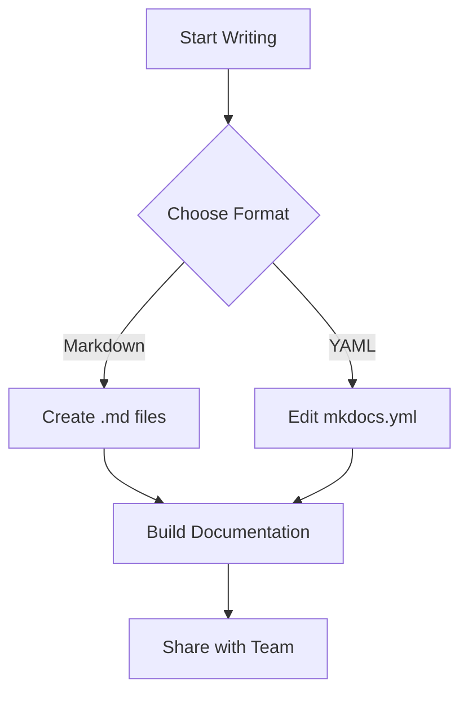

# Welcome to Your Documentation

Welcome to your MkDocs documentation site! This is the homepage that appears when visitors first arrive.

## Getting Started

This documentation site was automatically generated because no existing documentation was found. You can customize it by:

1. **Editing this file**: Modify `docs/index.md` to change this homepage
2. **Adding new pages**: Create additional `.md` files in the `docs/` folder
3. **Customizing navigation**: Edit `mkdocs.yml` to control the site structure
4. **Changing the theme**: Modify the theme settings in `mkdocs.yml`

## Features

This site includes several powerful features out of the box:

### 📊 Mermaid Diagrams

Create beautiful diagrams using Mermaid syntax:



### 💡 Admonitions

Use callout boxes to highlight important information:

!!! note "Getting Help"
    If you need help customizing your documentation, check out the [MkDocs documentation](https://www.mkdocs.org/) or the [Material theme guide](https://squidfunk.github.io/mkdocs-material/).

!!! tip "Pro Tip"
    You can use different types of admonitions like `note`, `tip`, `warning`, `danger`, `success`, and more!

### ✅ Task Lists

Create interactive checklists:

- [x] Set up MkDocs
- [x] Write homepage content
- [ ] Add more pages
- [ ] Customize theme
- [ ] Share with team

### 🎨 Code Highlighting

Beautiful syntax highlighting for code blocks:

```python
def generate_docs():
    """Generate beautiful documentation with MkDocs."""
    print("Building awesome docs! 🚀")
    return "Success!"
```

```yaml
# Example mkdocs.yml configuration
site_name: My Documentation
theme:
  name: material
  palette:
    primary: blue
    accent: blue
```

## Next Steps

1. **Create content**: Add your own markdown files to replace these examples
2. **Organize structure**: Use folders to organize your content logically
3. **Configure navigation**: Edit the `nav` section in `mkdocs.yml`
4. **Add images**: Place images in `docs/assets/` and reference them in your markdown
5. **Customize styling**: Add custom CSS in `docs/assets/extra.css`

## Resources

- [MkDocs User Guide](https://www.mkdocs.org/user-guide/)
- [Material Theme Documentation](https://squidfunk.github.io/mkdocs-material/)
- [Markdown Syntax Guide](https://www.markdownguide.org/basic-syntax/)
- [Mermaid Diagram Syntax](https://mermaid-js.github.io/mermaid/)

Happy documenting! 📚✨